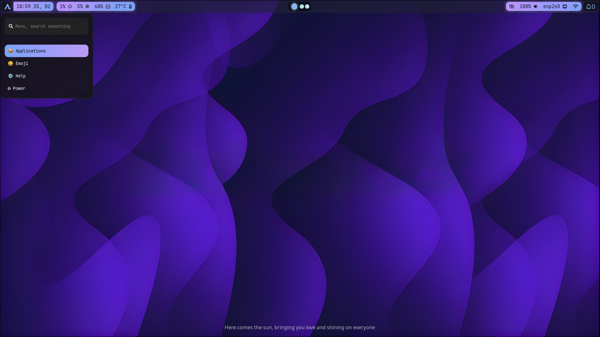

# [](https://git.io/typing-svg)
###### This rice takes inspriration from some repos, so it's not 100% pure my creation

## Infomations

<details>
  <summary><strong>Installation</strong></summary>

  - Run `git clone --depth=1 https://github.com/minh-null/dot-and-dot.git`
    - Then go into this repo using `cd dot-and-dot` and run `./setup install`
    - Turn `install.sh` into an executable using `chmod +x install.sh`
    - Run the script `./install.sh`

</details>

<details>
  <summary><strong>Software I Use</strong></summary>

  <details>
    <summary>Terminal / CLI Tools</summary>

  - [Kitty](https://github.com/kovidgoyal/kitty)
  - [Cava](https://github.com/karlstav/cava)
  - [Asciiquarium](https://github.com/cmatsuoka/asciiquarium)
  - [Fastfetch](https://github.com/fastfetch-cli/fastfetch)
  - [Hyfetch](https://github.com/hykilpikonna/hyfetch)
  - [Zsh](https://github.com/zsh-users/zsh)
  - [Oh My Zsh](https://github.com/ohmyzsh/ohmyzsh)
  - [btop](https://github.com/aristocratos/btop)
  - [Momoisay](https://github.com/Momo-Softworks/momoisay)
  - [Cowsay](https://github.com/cowsay-org/cowsay)
  - [Fortune (fortune-mod)](https://github.com/shlomif/fortune-mod)

  </details>

  <details>
    <summary>File Managers</summary>

  - [Dolphin](https://github.com/KDE/dolphin)
  - [ez-fm](https://github.com/TechyTechster/ez-fm.git)

  </details>

  <details>
    <summary>Status Bar</summary>

  - [Waybar](https://github.com/Alexays/Waybar)

  </details>

  <details>
    <summary>Lock Screen + Session Manager</summary>

  - [Hyprlock](https://github.com/hyprwm/hyprlock)
  - [SDDM](https://github.com/sddm/sddm)

  </details>

</details>

## Image/Media


[](assets/rice.webm)

## File structure
```
marchyso
├── assets
│   ├── rice2.jpg
│   ├── rice.gif
│   └── rice.jpg
├── config
│   ├── cava
│   │   ├── config
│   │   ├── shaders
│   │   │   ├── bar_spectrum.frag
│   │   │   ├── eye_of_phi.frag
│   │   │   ├── northern_lights.frag
│   │   │   ├── pass_through.vert
│   │   │   ├── spectrogram.frag
│   │   │   └── winamp_line_style_spectrum.frag
│   │   └── themes
│   │       ├── solarized_dark
│   │       └── tricolor
│   ├── fastfetch
│   │   └── config.jsonc
│   ├── hyfetch.json
│   ├── hypr
│   │   ├── avatar.png
│   │   ├── Fonts
│   │   │   ├── JetBrains
│   │   │   │   └── JetBrains Mono Nerd.ttf
│   │   │   └── SF Pro Display
│   │   │       ├── SF Pro Display Bold.otf
│   │   │       └── SF Pro Display Regular.otf
│   │   ├── hyprland.conf
│   │   ├── hyprlock.conf
│   │   ├── hyprlock.png
│   │   ├── hyprpaper.conf
│   │   ├── hyprsettings.toml
│   │   ├── monitors.conf
│   │   └── Scripts
│   │       └── songdetail.sh
│   ├── hyprwave
│   │   ├── config.conf
│   │   └── style.css
│   ├── minh_lol_custom_design.omp.json
│   ├── swaync
│   │   ├── config.json
│   │   └── style.css
│   ├── waybar
│   │   ├── config.jsonc
│   │   └── style.css
│   └── wofi
│       ├── config
│       ├── style.css
│       └── style-keybinds.css
├── install.sh
├── local-bin
│   ├── emoji-picker
│   ├── oh-my-posh
│   ├── wofi-keybinds
│   ├── wofi-launcher
│   └── wofi-power
├── pixie-sddm
│   ├── assets
│   │   ├── avatar.jpg
│   │   ├── background.jpg
│   │   └── fonts
│   │       ├── FlexRounded-B.ttf
│   │       ├── FlexRounded-M.ttf
│   │       └── FlexRounded-R.ttf
│   ├── components
│   │   ├── Clock.qml
│   │   └── PowerBar.qml
│   ├── install.sh
│   ├── LICENSE
│   ├── Main.qml
│   ├── metadata.desktop
│   └── theme.conf
├── README.md
└── wallpapers
    ├── 6418406.jpg
    ├── macos-monterey-wwdc-21-stock-dark-mode-5k-3840x2160-5585.jpg
    ├── purple.jpeg
    └── win11-violet.jpg
```

## Link to the animated thing
### 
## Have Fun ricing :3

MARCHYSO / **M**inh_null's **A**r**C**h **R**ice for **H**yprland, but **Y**ummy, **S**illy and un**O**ptimised :3
